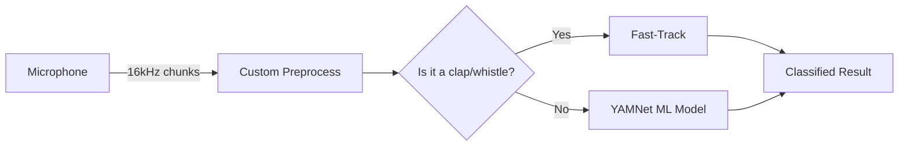

# Audio_Classifier  

---
### Sound Classifier's Core Capabilities:
- 500ms end-to-end latency (16kHz @ 8000-sample chunks)
- Signal processing: Custom FFT (whistles) + peak detection (claps)
- ML classification: MediaPipe's YAMNet (521-class model)
---

